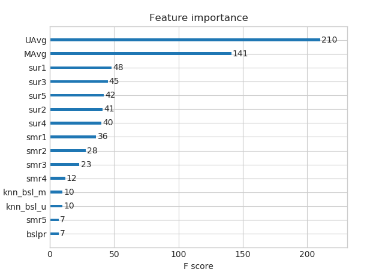

# Netflix-Recommendation

<h1>1. Business Problem </h1>
<h2> 1.1 Problem Description </h2>

Netflix is all about connecting people to the movies they love. To help customers find those movies, they developed world-class movie recommendation system: CinematchSM. Its job is to predict whether someone will enjoy a movie based on how much they liked or disliked other movies. Netflix use those predictions to make personal movie recommendations based on each customer’s unique tastes. And while <b>Cinematch</b> is doing pretty well, it can always be made better.

Now there are a lot of interesting alternative approaches to how Cinematch works that netflix haven’t tried. Some are described in the literature, some aren’t. We’re curious whether any of these can beat Cinematch by making better predictions. Because, frankly, if there is a much better approach it could make a big difference to our customers and our business.

 Credits: https://www.netflixprize.com/rules.html 

<h2> 1.2 Problem Statement </h2>

Netflix provided a lot of anonymous rating data, and a prediction accuracy bar that is  better than what Cinematch can do on the same training data set. (Accuracy is a measurement of how closely predicted ratings of movies match subsequent actual ratings.) 

<h2>1.4 Real world/Business Objectives and constraints  </h2>

Objectives:
1. Predict the rating that a user would give to a movie that he ahs not yet rated.
2. Minimize the difference between predicted and actual rating (RMSE and MAPE)
 

Constraints:
1. Some form of interpretability.

<h1> 2. Machine Learning Problem </h1>

<h2>2.1 Data </h2>

<h3> 2.1.1 Data Overview </h3>

 Get the data from : https://www.kaggle.com/netflix-inc/netflix-prize-data/data 

 Data files : 
<ul> 
<li> combined_data_1.txt </li>
<li> combined_data_2.txt </li>
<li> combined_data_3.txt </li>
<li> combined_data_4.txt </li>
<li> movie_titles.csv </li>
</ul>
<pre>  
The first line of each file [combined_data_1.txt, combined_data_2.txt, combined_data_3.txt, combined_data_4.txt] contains the movie id followed by a colon. Each subsequent line in the file corresponds to a rating from a customer and its date in the following format:

CustomerID,Rating,Date

MovieIDs range from 1 to 17770 sequentially.
CustomerIDs range from 1 to 2649429, with gaps. There are 480189 users.
Ratings are on a five star (integral) scale from 1 to 5.
Dates have the format YYYY-MM-DD.
</pre>

<h3> 2.1.2 Example Data point </h3>

<pre>
1:
1488844,3,2005-09-06
822109,5,2005-05-13
885013,4,2005-10-19
30878,4,2005-12-26
823519,3,2004-05-03
893988,3,2005-11-17
124105,4,2004-08-05
1248029,3,2004-04-22
1842128,4,2004-05-09
2238063,3,2005-05-11
1503895,4,2005-05-19
2207774,5,2005-06-06
2590061,3,2004-08-12
2442,3,2004-04-14
543865,4,2004-05-28
1209119,4,2004-03-23
804919,4,2004-06-10
1086807,3,2004-12-28
1711859,4,2005-05-08
372233,5,2005-11-23
1080361,3,2005-03-28
1245640,3,2005-12-19
558634,4,2004-12-14
2165002,4,2004-04-06
1181550,3,2004-02-01
1227322,4,2004-02-06
427928,4,2004-02-26
814701,5,2005-09-29
808731,4,2005-10-31
662870,5,2005-08-24
337541,5,2005-03-23
786312,3,2004-11-16
1133214,4,2004-03-07
1537427,4,2004-03-29
1209954,5,2005-05-09
2381599,3,2005-09-12
525356,2,2004-07-11
1910569,4,2004-04-12
2263586,4,2004-08-20
2421815,2,2004-02-26
1009622,1,2005-01-19
1481961,2,2005-05-24
401047,4,2005-06-03
2179073,3,2004-08-29
1434636,3,2004-05-01
93986,5,2005-10-06
1308744,5,2005-10-29
2647871,4,2005-12-30
1905581,5,2005-08-16
2508819,3,2004-05-18
1578279,1,2005-05-19
1159695,4,2005-02-15
2588432,3,2005-03-31
2423091,3,2005-09-12
470232,4,2004-04-08
2148699,2,2004-06-05
1342007,3,2004-07-16
466135,4,2004-07-13
2472440,3,2005-08-13
1283744,3,2004-04-17
1927580,4,2004-11-08
716874,5,2005-05-06
4326,4,2005-10-29
</pre>

<h2>2.2 Mapping the real world problem to a Machine Learning Problem </h2>

<h3> 2.2.1 Type of Machine Learning Problem </h3>

<pre>
For a given movie and user we need to predict the rating would be given by him/her to the movie. 
The given problem is a Recommendation problem 
It can also seen as a Regression problem 
</pre>

<h3> 2.2.2 Performance metric </h3>

<ul>
<li> Mean Absolute Percentage Error: https://en.wikipedia.org/wiki/Mean_absolute_percentage_error </li>
<li> Root Mean Square Error: https://en.wikipedia.org/wiki/Root-mean-square_deviation </li>
</ul>

<h3> 2.2.3 Machine Learning Objective and Constraints </h3>

1. Minimize RMSE. 
2. Try to provide some interpretability. 

<h1> 3. Exploratory Data Analysis </h1>

<h2> 3.1 Preprocessing</h2> 

- Here we are converting / merging whole data to required format: u_i, m_j, r_ij</h3> 

- We checking for NaN values and make sure all are deleted. 

-  Removing Duplicates is also done. 

<h3>3.1.4 Basic Statistics (#Ratings, #Users, and #Movies)</h3>

Total no of ratings : 100480507 
Total No of Users   : 480189 
Total No of movies  : 17770 

<h2>3.2 Spliting data into Train and Test(80:20) </h2>

<h3>3.2.1 Basic Statistics in Train data (#Ratings, #Users, and #Movies)</h3>

Total no of ratings : 80384405 
Total No of Users   : 405041 
Total No of movies  : 17424 

<h3>3.2.2 Basic Statistics in Test data (#Ratings, #Users, and #Movies)</h3>

Total no of ratings : 20096102 
Total No of Users   : 349312 
Total No of movies  : 17757 

 <h2> 3.3 Exploratory Data Analysis on Train data </h2>
 
 <h3> 3.3.1 Distribution of ratings over training set.</h3> 
 
   
   
 - We add a new column (week day) to the data set for analysis 'day_of_week'. 
 
 <h3> 3.3.2 Number of Ratings per a month </h3> 
 
  
  
  <h3> 3.3.3 Analysis on the Ratings given by user </h3> 
  
 - Below are the ratings the top number of movies rated by a particular user. 
 
 user
305344     17112
2439493    15896
387418     15402
1639792     9767
1461435     9447
 
 - The CDF and PDF are plotted below for the number of ratings per user. 
 
 - When we use the describe function we get the below results. 
 
   count    405041.000000 
   mean        198.459921 
   std         290.793238 
   min           1.000000 
   25%          34.000000 
   50%          89.000000 
   75%         245.000000 
   max       17112.000000 
 
 - Looks like we may have to inspect the percentile to see how many values are abnormally high. 
 - On plotting value at quantiles vs no of ratings by users, we get the below plot.  
 
 
 
 - We can tell that the last 5 percentile of users have given  extremly high no of ratings and total number of ratings at last 5 percentile : 20305  
 
 
 <h3> 3.3.4 Analysis of ratings of a movie given by a user </h3>
 
 - On plotting ratings per movie we get the below graph.  
 
 
 
 - It is very skewed.. just like nunmber of ratings given per user. 
 - There are some movies (which are very popular) which are rated by huge number of users. 
 - But most of the movies(like 90%) got some hundereds of ratings. 
 
 <h3> 3.3.5 Number of ratings on each day of the week</h3>
 
 - On plotting number of users per day we get the below graph. 
 
 
 
 - Now plotting box plot for ratings given for each day of the week.  
 
  
  
  - The average we see below shows that there is not much of a difference here.
  
  AVerage ratings 
------------------------------
 day_of_week 
 Friday       3.585274 
 Monday       3.577250 
 Saturday     3.591791 
 Sunday       3.594144 
 Thursday     3.582463 
 Tuesday      3.574438 
 Wednesday    3.583751 
 
 <h3> 3.3.6 Creating sparse matrix from data frame </h3>
 
 - Since its a sparse matrix and without compressing we would require very high space.Hence we use compressed sparse matrix. 
 
 <h3>3.3.7 Finding Global average of all movie ratings, Average rating per user, and Average rating per movie</h3>
 
 <h4> 3.3.7.1 finding global average of all movie ratings </h4> 
  - {'global': 3.582890686321557} 
  
 <h4> 3.3.7.2 finding average rating per user</h4> 
 - Average rating of user 10 : 3.3781094527363185  
 
 <h4> 3.3.7.3 finding average rating per movie</h4> 
 - Average rating of movie 15 : 3.3038461538461537 
 
 <h4> 3.3.7.4 PDF's & CDF's of Avg.Ratings of Users & Movies (In Train Data)</h4>
  - We get the below plot. 
  
   
   
 <h3> 3.3.8 Cold Start problem </h3>
 
 <h4> 3.3.8.1 Cold Start problem with Users</h4>
 
    Total number of Users  : 480189 

    Number of Users in Train data : 405041 

    No of Users that didn't appear in train data: 75148(15.65 %)  
    
  - We might have to handle new users ( 75148 ) who didn't appear in train data. 
  
  <h4> 3.3.8.2 Cold Start problem with Movies</h4> 
  
    Total number of Movies  : 17770 

    Number of Users in Train data : 17424 

    No of Movies that didn't appear in train data: 346(1.95 %)  
    
  - We might have to handle 346 movies (small comparatively) in test data. 
  
 <h2> 3.4 Computing Similarity matrices </h2>
 
 <h3> 3.4.1 Computing User-User Similarity matrix </h3>
 
 -  Calculating User User Similarity_Matrix is not easy  because of  number of users being large.
 
 <h4> 3.4.1.2 Trying with reduced dimensions (Using TruncatedSVD for dimensionality reduction of user vector)</h4>
 
 - We have  **405,041 users** in out training set and computing similarities between them..( **17K dimensional vector..**) is time consuming. 
    
 - Instead, we will try to reduce the dimentsions using SVD, so that it might speed up the process. 
 - We reduced the dimensions to 500 which explained 65 percent of the variance.
 - While running however it took more time than the earlier method.
 
 - An alternative is to compute similar users for a particular user,  whenenver required (**ie., Run time**) 
 - We maintain a binary Vector for users, which tells us whether we already computed or not. 
 - If not we compute top (let's just say, 1000) most similar users for this given user, and add this to our datastructure, so that we      can just access it(similar users) without recomputing it again. 
 - If it is already computed. 
        - Just get it directly from our datastructure, which has that information.
        - In production time, we might have to recompute similarities, if it is computed a long time ago. Because user preferences                 changes over time. If we could maintain some kind of timer, which when expires, we have to update it ( recompute it ). 
        - It is purely implementation dependant.  
 - The data structure that  we can use is to maintain a dictionary Of dictionaries.We can do it in the below manner.
       - key : userid 
       - value : Again a dictionary 
       - key : Similar User 
       - value : Similarity Value 
       
 <h3> 3.4.2 Computing Movie-Movie Similarity matrix </h3>

- Even though we have similarity measure of each movie, with all other movies, We generally don't care much about least similar movies. .

- Most of the times, only top_xxx similar items matters. It may be 10 or 100. 

- We take only those top similar movie ratings and store them  in a saperate dictionary. 

<h3> 3.4.3 Finding most similar movies using similarity matrix </h3>

- We shall check if similarity really works as the way we expected by picking some randomn movie and check for its similiar movies. 

- We took a randomn movie Id 67 and the deatils of it were obtained as shown below. 
 
     - Movie -----> Vampire Journals 

    - It has 270 Ratings from users. 

    - We have 17284 movies which are similar to this and we will get only top most. 
    
 - On plotting the number of movies vs cosine similiarity for the above movie we get the below graph. 
 
 
 
 - Similarly we can find similar users and find how similar they are. 
 
  <h1> 4.  Machine Learning Models </h1>
  
  <h2> 4.1 Sampling Data </h2>
  
   - We build sample train data from the train data. 
   - We are taking 10k x 1k instead of 405k x 17k. 
   - We are taking 5k x 500 instaed of349k x 17k. .
   - This is to check the best method./br>.
   
   <h2>4.2 Finding Global Average of all movie ratings, Average rating per User, and Average rating per Movie (from sampled train)</h2>
   
   - The global average of ratings in the test set 3.581679377504138. .
   - We are finding average rating per user. 
   - Finding Average rating per Movie. 
   
   
   - Reading from the file to make a Train_dataframe .
   
   - We will have the below features .
   
   - __GAvg__ : Average rating of all the ratings  

   - __Similar users rating of this movie__:- sur1, sur2, sur3, sur4, sur5 ( top 5 similar users who rated that movie.. ) 
    

   - __Similar movies rated by this user__: - smr1, smr2, smr3, smr4, smr5 ( top 5 similar movies rated by this movie.. ) 

   - __UAvg__ : User's Average rating 

   - __MAvg__ : Average rating of this movie .

   - __rating__ : Rating of this movie by this use .
   
   
 - The same is repeated for test set .
 
 <h3> 4.3.2 Transforming data for Surprise models</h3>
 
 <h4> 4.3.2.1 Transforming train data </h4>
 
 - We can't give raw data (movie, user, rating) to train the model in Surprise library. 

- They have a seperate format for TRAIN and TEST data, which will be useful for training the models like SVD, KNNBaseLineOnly....etc..,in Surprise. 

- We can form the trainset from a file, or from a Pandas  DataFrame. 

<h2> 4.4 Applying Machine Learning models </h2>

<h3> 4.4.1 XGBoost with initial 13 features </h3>

- Training the model.. 
- Done. Time taken : 0:00:01.795787 

Done 

Evaluating the model with TRAIN data... 
Evaluating Test data 

TEST DATA 
------------------------------
RMSE :  1.0761851474385373 
MAPE :  34.504887593204884 

- We get the below feature importance.

<h3> 4.4.2 Suprise BaselineModel </h3>

- We get the below results after applying the baseline model. 

Training the model... 
Estimating biases using sgd... 
Done. time taken : 0:00:00.822391  

Evaluating the model with train data.. 
time taken : 0:00:01.116752 
---------------
Train Data 
---------------
RMSE : 0.9347153928678286 

MAPE : 29.389572652358183 

adding train results in the dictionary.. 

Evaluating for test data... 
time taken : 0:00:00.074418 
---------------
Test Data 
---------------
RMSE : 1.0730330260516174 

MAPE : 35.04995544572911 

storing the test results in test dictionary... 

---------------------------------------------
Total time taken to run this algorithm : 0:00:02.014073 

<h3> 4.4.3 XGBoost with initial 13 features + Surprise Baseline predictor </h3>

- We add our baseline_predicted value as our feature to both train and test data.  

- We get the below results. 

Training the model.. 
Done. Time taken : 0:00:02.388635 

Done  

Evaluating the model with TRAIN data... 
Evaluating Test data 

TEST DATA 
------------------------------
RMSE :  1.0763419061709816 
MAPE :  34.491235560745295 

- The feature importance graph is as shown below. 

<h3> 4.4.4 Surprise KNNBaseline predictor </h3>

- But we use shrunk Pearson-baseline correlation coefficient, which is based on the pearsonBaseline similarity ( we take base line predictions instead of mean rating of user/item). 

<h4> 4.4.4.1 Surprise KNNBaseline with user user similarities</h4>

- We get the below results. 

Training the model... 
Estimating biases using sgd... 
Computing the pearson_baseline similarity matrix... 
Done computing similarity matrix. 
Done. time taken : 0:00:30.173847  

Evaluating the model with train data.. 
time taken : 0:01:35.970614 
---------------
Train Data 
---------------
RMSE : 0.33642097416508826 

MAPE : 9.145093375416348 

adding train results in the dictionary.. 

Evaluating for test data... 
time taken : 0:00:00.075213 
---------------
Test Data 
---------------
RMSE : 1.0726493739667242 

MAPE : 35.02094499698424 

storing the test results in test dictionary... 

<h4> 4.4.4.2 Surprise KNNBaseline with movie movie similarities</h4>

- We get the below results. 

Training the model...  
Estimating biases using sgd... 
Computing the pearson_baseline similarity matrix... 
Done computing similarity matrix. 
Done. time taken : 0:00:01.093096  

Evaluating the model with train data.. 
time taken : 0:00:07.964272 
---------------
Train Data 
---------------
RMSE : 0.32584796251610554 

MAPE : 8.447062581998374 

adding train results in the dictionary.. 

Evaluating for test data... 
time taken : 0:00:00.075229 
---------------
Test Data 
---------------
RMSE : 1.072758832653683 

MAPE : 35.02269653015042 

storing the test results in test dictionary... 

<h3> 4.4.5 XGBoost with initial 13 features + Surprise Baseline predictor + KNNBaseline predictor </h3>

-  First we will run XGBoost with predictions from both KNN's ( that uses User\_User and Item\_Item similarities along with our previous features. 

 
-  Then we will run XGBoost with just predictions form both knn models and preditions from our baseline model. 

- We get the below results. 

  Training the model.. 
  Done. Time taken : 0:00:02.092387 

  Done  

  Evaluating the model with TRAIN data... 
  Evaluating Test data 

 TEST DATA 
 ------------------------------
 RMSE :  1.0763602465199797 
 MAPE :  34.48862808016984 

- The feature importnace is shown as below.

<h3> 4.4.6 Matrix Factorization Techniques </h3> 

<h4> 4.4.6.1 SVD Matrix Factorization User Movie intractions </h4> 

- We get the below results. 

Evaluating the model with train data.. 
time taken : 0:00:01.305539 
---------------
Train Data 
---------------
RMSE : 0.6574721240954099 

MAPE : 19.704901088660474 

adding train results in the dictionary.. 

Evaluating for test data... 
time taken : 0:00:00.067811 
---------------
Test Data 
---------------
RMSE : 1.0726046873826458 

MAPE : 35.01953535988152 

storing the test results in test dictionary... 

<h4> 4.4.6.2 SVD Matrix Factorization with implicit feedback from user ( user rated movies ) </h4>

- __Optimization problem with user item interactions and regularization (to avoid overfitting)__
    - 
    - $ \large \sum_{r_{ui} \in R_{train}} \left(r_{ui} - \hat{r}_{ui} \right)^2 +
\lambda\left(b_i^2 + b_u^2 + ||q_i||^2 + ||p_u||^2 + ||y_j||^2\right) $ 

- We get the below results. 

Evaluating the model with train data.. 
time taken : 0:00:06.387920 
---------------
Train Data 
---------------
RMSE : 0.6032438403305899 

MAPE : 17.49285063490268 

adding train results in the dictionary.. 

Evaluating for test data... 
time taken : 0:00:00.071642 
---------------
Test Data 
---------------
RMSE : 1.0728491944183447 

MAPE : 35.03817913919887 

storing the test results in test dictionary... 

<h3> 4.4.7 XgBoost with 13 features + Surprise Baseline + Surprise KNNbaseline + MF Techniques </h3>

- We get the below results. 

Training the model.. 
Done. Time taken : 0:00:04.203252 

Done  

Evaluating the model with TRAIN data... 
Evaluating Test data 

TEST DATA 
------------------------------
RMSE :  1.0763580984894978 
MAPE :  34.487391651053336 

- The features importance is shown below. 

<h3> 4.4.8 XgBoost with Surprise Baseline + Surprise KNNbaseline + MF Techniques </h3>
- We get the below results. 
- Training the model.. 
Done. Time taken : 0:00:01.292225 

Done  

Evaluating the model with TRAIN data... 
Evaluating Test data 

TEST DATA 
------------------------------
RMSE :  1.075480663561971 
MAPE :  35.01826709436013 

- The feature importance is as shown below. 

<h2> 4.5 Comparision between all models </h2>

- Final comparison is shown as below.

  svd               1.0726046873826458 
  knn_bsl_u         1.0726493739667242 
  knn_bsl_m          1.072758832653683 
  svdpp             1.0728491944183447 
  bsl_algo          1.0730330260516174 
  xgb_knn_bsl_mu    1.0753229281412784 
  xgb_all_models     1.075480663561971 
  first_algo        1.0761851474385373 
  xgb_bsl           1.0763419061709816 
  xgb_final         1.0763580984894978 
  xgb_knn_bsl       1.0763602465199797 

 
  
  
 
 
 
